## Demo Image

This is a [Virtual Box](https://www.virtualbox.org/) image that contains [CentOS](http://www.centos.org/) 6.4 with Wakame-vdc pre-installed. This is intended for people to get a first introduction to Wakame-vdc with a minimal amount of configuring required.

[Download the Wakame-vdc demo image](http://dlc.wakame.axsh.jp/demo/1box/vmdk/1box-openvz.netfilter.x86_64.vmdk.20150212150344gitef418eb.zip).

Unzipped mp5 sum: 7bc7587a0d60629c87895173b093b3bd

Zipped md5 sum: 41d04365f36cd034ae1f9605e07c189f

## Requirements

Any computer with an x86_64 processor capable of running VirtualBox.

## What works?

### Instances

This is Wakame-vdc’s key functionality. The ability to start and terminate virtual servers which we call *instances*.

### Security Groups

This is Wakame-vdc’s netfilter based dynamic firewall. You can create *security groups* and place *instances* in them. These groups have two functions to them.

* Firewall

Users are able to write firewall rules into *security groups*. This will open specific ports on all *instances* in the group.

* Isolation

This provides ARP and IP based isolation between *instances*. Only *Instances* that are in the same *security group* will be able to communicate on the network. In other words, *instances* in group B will look like they don’t exist to *instances* in group A.

### Backups

This allows you to create a new *Wakame Machine Image* from an existing *instance*. You will then in turn be able to start new *instances* of the newly created *image*.

### Load Balancers

A *Load Balancer* in Wakame-vdc is a special *instance* that will have [HAProxy](http://haproxy.1wt.eu/) running in it and can balance network traffic between *instances*. It’s also capable of doing OpenSSL encryption using [Stud](https://github.com/bumptech/stud).

### SSH Key Pairs

We can log into instances over SSH using RSA private/public *key pairs*. You can let Wakame-vdc create a *key pair* for you or you can register your own existing public key.

## What doesn’t work?

### Volumes

*Volumes* are virtual hard drives that can be attached to and detached from *instances* at will. It’s essentially a virtual version of USB hard drives that you can pass around and plug into different computers.

You will be able to create and delete *volumes* but you won’t be able to attach them to *instances*. That’s because the Wakame-vdc demo image uses OpenVz as the hypervisor for *instances*. At the time of writing, *volumes* are not supported in our OpenVz implementation.

## Setup

Download and unzip the image.

In VirtualBox, click *File* and select *Preferences*.

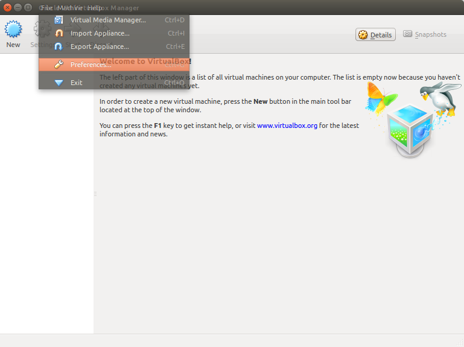

Click on Network and create a new host-only network.

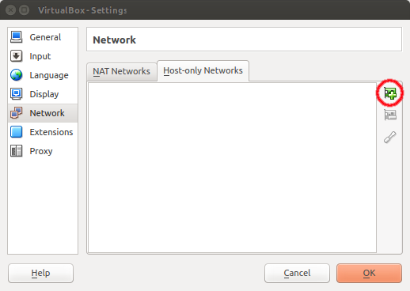

Now click on the screwdriver icon for host-only network settings.

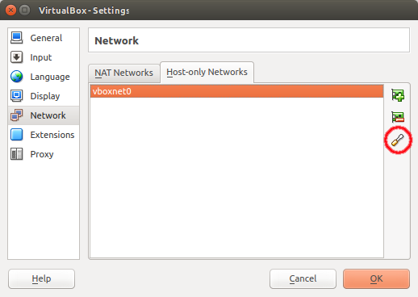

Set the IPv4 subnet to 10.0.2.2/24. Leave IPv6 fields blank.

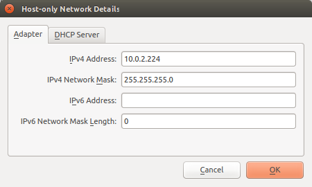

Disable the host-only network’s DHCP server.

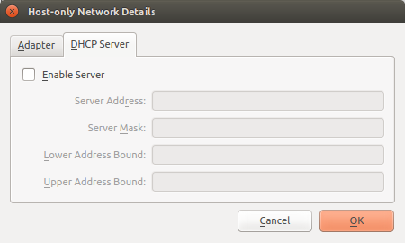

You’re done with VirtualBox preferences. Now create a new virtual machine.

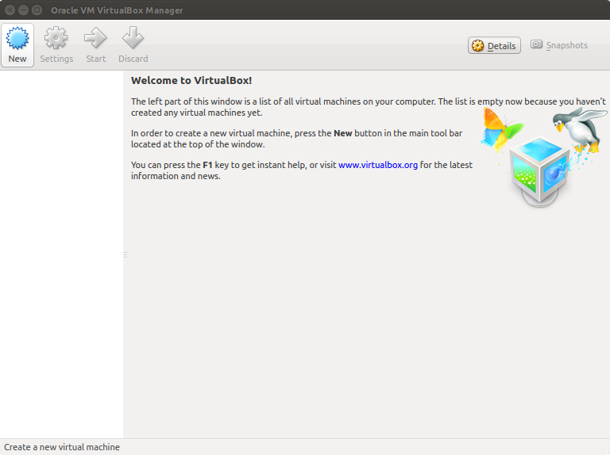

Set the following settings for name and operating system.

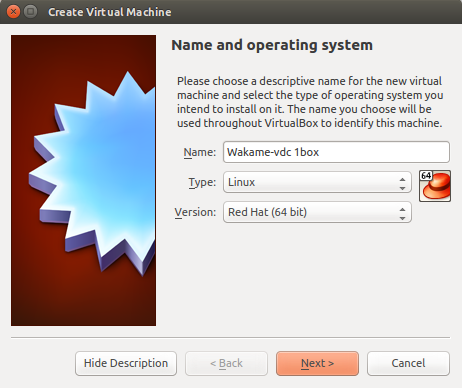

Set the memory size for the VM. 3GB recommended. 1GB minimal.

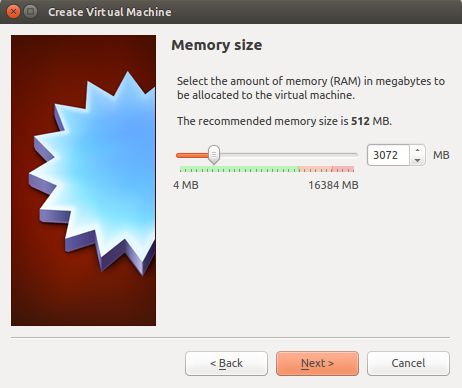

Select *Use an existing virtual hard drive file* and browse to the Wakame-vdc demo image that you have downloaded.

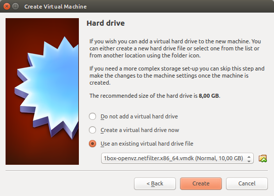

You’ve now set up a VirtualBox VM but you still need to do some extra network settings before Wakame-vdc will work right. Select your new VM and click on *Settings*.

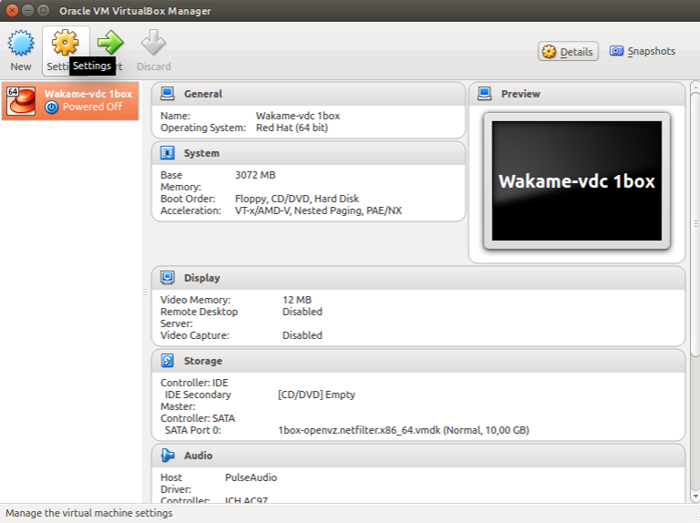

Click *Network* and enable *Adapter 1*. Attach it to the *Host-only Adapter* that you have created above. Make sure to set *Promiscuous Mode* to *Allow All*. This will allow us to make network connections to Wakame-vdc instances.

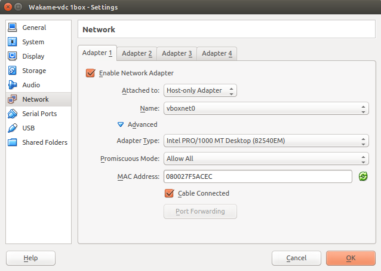

Also enable *Adapter 2* and attach it to an *Internal Network*. Again set *Promiscuous Mode* to *Allow All*.

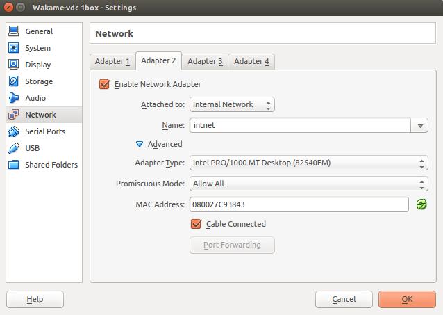

You’re done. Start the Wakame-vdc demo image.

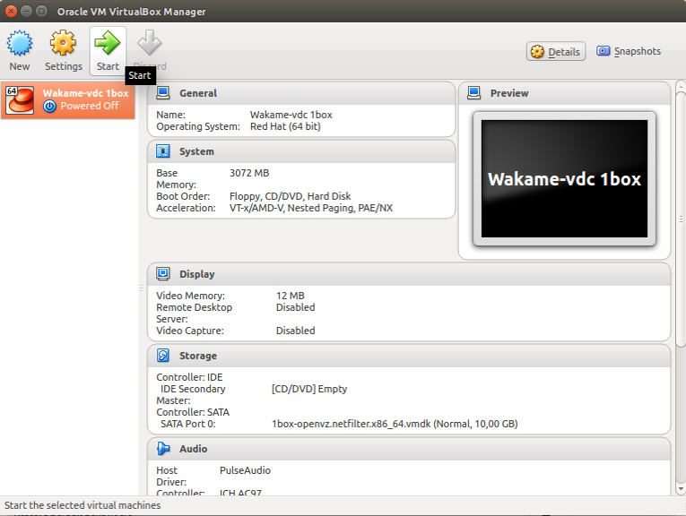

On first boot, the image will take some time to set up several Wakame-vdc services like the MySQL databases.

## Usage

You can access Wakame-vdc’s WebUI by surfing to [http://10.0.2.15:9000](http://10.0.2.15:9000) in a browser of your choice. Javascript needs to be enabled for the WebUI to function. Log into the WebUI with the following credentials.

```
Username: demo
Password: demo
```

Before you can start an *instance*, you will need to create a *security group* and a *key pair*. Click on *Security Groups* in the menu on the left and click on *Create Security Group*. Choose a name for your group and paste the following rules. These example rules will open ports for ssh, http, dns and ping.

```
# demo rules for demo instances
tcp:22,22,ip4:0.0.0.0
tcp:80,80,ip4:0.0.0.0
udp:53,53,ip4:0.0.0.0
icmp:-1,-1,ip4:0.0.0.0
```

Next we’ll create ourselves a *key pair*. Click on *Key Pairs* in the menu on the left. There should be a demo key already registered there. This is again a leftover from development that we haven’t had time to remove. Please ignore it.

Click on *Create Key Pair*. You can either register your own public key here, or have Wakame-vdc create a new one for you by leaving the *Public Key* field blank.

Now we’re ready to start an instance. Click on *Machine Images* in the menu on the left. There will be four *Wakame Machine Images* available here.

* haproxy1d64

This is the *Load Balancer* image. The fact that it appears in the list of *Wakame Machine Images* is a bug in the Wakame-vdc demo image. Since this is only a minor issue, we haven’t fixed it yet. *Load Balancers* are not intended to be started from this image. They should be started from the *LoadBalancers* option in the menu on the left.

* lbnode1d64

This is an *image* with a tiny http server on port 80 that returns the *instance’s* host name. This is intended to demonstrate the *load balancer*.

* vanilla1d64
* centos1d64

Both of these are simple *images* with a basic Centos 6.4 in them. The difference is that *vanilla1d64* has password authentication enabled and *centos1d64* doesn’t. Since no working users are configured for *vanilla1d64*, these *images* are essentially the same.

Let’s start an instance of *centos1d64* as an example. Select it and click *Launch Instance*. In the dialog that comes up, choose an *Instance Name* and an optional *Host Name*.

Choose an *Instance Spec* to launch your *instance* with. *Instance Specs* define the specifications of your *instance* such as amount of cpus and memory size. You can choose between the following three:

```
vz.small:
  cpu_cores: 1
  memory_size: 256
  hypervisor: 'openvz'
  quota_weight: 1.0
vz.large:
  cpu_cores: 2
  memory_size: 256
  hypervisor: 'openvz'
  quota_weight: 2.0
vz.xlarge:
  cpu_cores: 2
  memory_size: 1536
  hypervisor: 'openvz'
  quota_weight: 2.0
```

You will see the *security group* you just created in *Available Groups*. Move it to *Launch in* so we can put our new instance in it.

Next we need to create a network interface for our *instance* and attach it to a network. Click the drop-down list next to *eth0*. You will see a list of many possible networks to attach it to. Choose the network *[nw-demo1] demo1*. The other networks are leftovers from our development environments and do not work in this image.

The *User Data* below that is a ambiguous field where you can fill in any metadata that you might want to pass to the image. You would then be able to read that data from any custom software you might have running in there. Right now we don’t have any of that stuff so go ahead and leave it blank.

Finally there’s *Network Monitoring*. This is a [Zabbix](http://www.zabbix.com/) based monitoring service. Just leave it disabled for now.

You’re done. Click on *Launch*.

You will now be able to see the *instance* when you click on *Instances* in the menu on the left. You will probably see your *instance* in the *initializing* state. This means Wakame-vdc is starting it up and it will take a little while. Even after your *instance’s* state turns to *running*, it will still take a little while for the OS inside of it to boot up completely.

If the instance state turns to *terminated*, that is likely due to a known bug that we have been encountering only in the Wakame-vdc demo image and haven’t had time to fix yet. Just try again. It’s likely that your instance will work the second time around.

You can ssh into the instance using the *key pair* that you created. They listen on port 22 and you can log in with username *root*. If your own computer is running Linux, this would be a typical command to log into an instance.

```
ssh -i /path/to/ssh/key.pem root@10.0.2.100
```

It’s possible that you will get this kind of message.

```
@@@@@@@@@@@@@@@@@@@@@@@@@@@@@@@@@@@@@@@@@@@@@@@@@@@@@@@@@@@
@         WARNING: UNPROTECTED PRIVATE KEY FILE!          @
@@@@@@@@@@@@@@@@@@@@@@@@@@@@@@@@@@@@@@@@@@@@@@@@@@@@@@@@@@@
Permissions 0744 for '/home/geek/ssh_demo.pem' are too open.
It is recommended that your private key files are NOT accessible by others.
This private key will be ignored.
bad permissions: ignore key: /home/geek/ssh_demo.pem
```

That means everybody can read your private key and that’s not very private now is it? Change your key’s permissions with the following command.

```
chmod 600 /path/to/shh/key.pem
```

## Troubleshooting

If you need to do any troubleshooting, you can ssh into the Wakame-vdc demo image with the following credentials. The image’s ip is 10.0.2.15 and ssh is running on the standard tcp port of 22.

```
Username: centos
Password: centos
```

Wakame-vdc’s logs are located in the following directory:

```
/var/log/wakame-vdc/
```

Wakame-vdc’s configuration files are located here:

```
/etc/wakame-vdc/
```

You can perform a large number of CRUD tasks on the Wakame-vdc database using the *vdc-manage* command line interface. To use to type the following:

```
[centos@wakame-vdc-1box ~]$ cd /opt/axsh/wakame-vdc/dcmgr/bin/
[centos@wakame-vdc-1box bin]$ ./vdc-manage
vdc-manage>> help
```

*vdc-manage* will give you a list of sub commands. You can type any of them followed by help to get more specific usage on them. There is a similar cli for the WebUI.

```
[centos@wakame-vdc-1box ~]$ cd /opt/axsh/wakame-vdc/frontend/dcmgr_gui/bin/
[centos@wakame-vdc-1box bin]$ ./gui-manage
gui-manage>> help
```
