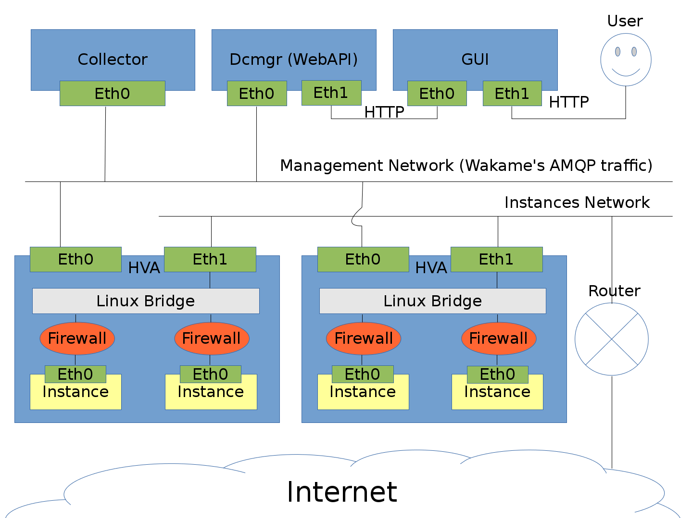

# Networking guide

## Contents

* [A typical Wakame-vdc networking setup](#A-typical-Wakame-vdc-networking-setup)
* [The instances network](#The-instances-network)
  - [How are instance IP Addresses set?](#How-are-Instance-IP-Addresses-set?)
  - [How are firewalls implemented?](#How-are-the-firewalls-implemented?)
  - [Can I add my own Iptables or Ebtables rules?](#Can-I-add-my-own-Iptables-or-Ebtables-rules?)
  - [How can I get internet from the instances?](#How-can-I-get-internet-from-the-instances?)
* [The management network](#The-management-network)
  - [How do Wakame-vdc's nodes communicate?](#How-do-Wakame-vdc's-nodes-communicate?)
  - [Do users need AMQP?](#Do-users-need-AMQP?)
* [OpenVNet](#OpenVNet)

## A typical Wakame-vdc networking setup




## The instances network

The is the network that instances are connected to.

[[HVA|Jargon-Dictionary#HVA]] uses bridged networking for instances. [[Instances|Jargon-Dictionary#Instance]] are connected to a [Linux Bridge](http://www.linuxfoundation.org/collaborate/workgroups/networking/bridge). When using more than one HVA node, The bridges of each HVA will need to be connected to each other. After all, Instances are expected to be in the same network together regardless of what HVA they are started on.

You will need to set up the Linux bridges manually and then register the networks using [[vdc-manage|Jargon-Dictionary#vdc-manage]].

You can set up any number of bridges and networks. Wakame-vdc will use a process called [[scheduling|Jargon-Dictionary#Scheduling]] to decide in which network an instance is started.

### How are Instance IP Addresses set?

Wakame-vdc adds a tiny hard drive ([[the meta-data drive|Jargon-Dictionary#Meta-data]]) to instances before booting them. The IP Address is stored on it. Machine images will have a `wakame-init` script that reads it from there.

These scripts can be found in [our source repository on github](https://github.com/axsh/wakame-vdc/tree/master/wakame-init). If you make a new one for another distribution, please let us know.

### How are the firewalls implemented?

From the user's perspective, firewalls are implemented as [[Security Groups|Jargon-Dictionary#Security-Group]].

From a technical perspective, it's implemented using [Netfilter](http://www.netfilter.org). Each HVA will have a set of [Iptables](http://www.netfilter.org/projects/iptables/) and [Ebtables](http://ebtables.netfilter.org) rules that do filtering on L3 and L2 respectively.

Read the [[security groups page|security-groups]] for more information.

### Can I add my own Iptables or Ebtables rules?

Currently Wakame-vdc's [[HVA nodes|Jargon-Dictionary#HVA]] flush Iptables and Ebtables on startup. This is legacy behaviour that we want to move away from.

We do have a workaround in place. You can write your custom Iptables/Ebtables rules in a script and tell HVA to execute it after the flush. To do so, add the following line to `/etc/wakame-vdc/hva.conf`

```
config.netfilter_script_post_flush = '/path/to/your/custom/script.sh'
```

### How can I get internet from the instances?

Just like you would in any other network. You can place a router in the instances network that will connect to the internet. This router will not be managed by Wakame-vdc but you will have to register it using [[vdc-manage|Jargon-Dictionary#vdc-manage]].

Wakame-vdc also supports static (one to one) NAT which can be used to dynamically assign a public IP address to instances. Currently we have no documentation on it but the feature is called [[Natbox|Jargon-Dictionary#NATbox]].

## The management network

This is the network where Wakame-vdc's [[nodes|Jargon-Dictionary#Node]] communicate with each other. It is technically possible to use the same network as the instances network for this and that is exactly what the [[installation guide|install-guide]] is doing. On a production environment, it's often a good idea to separate them for security reasons.

### How do Wakame-vdc's nodes communicate?

They use [AMQP](http://www.amqp.org). Somewhere in the network, [RabbitMQ](http://www.rabbitmq.com) will be running.

Wakame-vdc's nodes need to be made aware of RabbitMQ's IP address and listening port. This can be done by editing their respective files in `/etc/default`. For HVA for example, that would be `/etc/default/vdc-hva`.

### Do users need AMQP?

No. Users do not need to be aware of the management network nor AMQP. They send http requests to Wakame-vdc's [[WebAPI|Jargon-Dictionary#WebAPI]].

## OpenVNet

[[OpenVNet|Jargon-Dictionary#OpenVNet]] is another project authored by [Axsh](Jargon-Dictionary#Axsh). It offers full network virtualization using [OpenFlow](http://archive.openflow.org).

Without OpenVNet, the system admin installing Wakame-vdc will set up the [instance networks](#Instances-network) manually and instances are started directly in it. When using OpenVNet, the instance networks are still set up manually but instances will no longer be started directly in them.

Instead, OpenVNet will create virtual networks that run on top of the instances network. [[Instances|Jargon-Dictionary#Instance]] will be started in these virtual networks. The result is that users are free to create their own network topology through Wakame-vdc's WebAPI or GUI.

It works much in the same way as virtual machines. When running a virtual machine, the OS is installed on virtual hardware that in turn runs on physical hardware. The result is that you can run many virtual machines on a single physical machine, and you can easily migrate those virtual machines over to another physical machine.

Using OpenVNet means that you will replace the [Linux bridge](http://www.linuxfoundation.org/collaborate/workgroups/networking/bridge) with [Open vSwitch](http://openvswitch.org). Also the firewall will be implemented using OpenFlow, as Open vSwitch does not have hooks for Netfilter.
