## What is covered here?

We are going to walk you through Wakame-vdc's most basic function which is starting instances. Instance is the term that Wakame-vdc uses for a virtual server. The reasoning behind this is that we're not booting virtual machine images directly. Instead we're booting copies of it. We're instantiating a virtual machine image.

At the end of this guide, we'll also tell you how to terminate started instances.

## Prerequisites

A working Wakame-vdc environment with at least one machine image registered. If you've followed the [installation guide](../installation.md) or the [VirtualBox demo image guide](http://wakameusersgroup.org/demo_image.html), you already have that.

## Guide

### Starting instances

Surf to the Wakame-vdc gui and log in. By default the GUI runs on port `9000`. Its ip address will be the one of whatever machine has installed the **wakame-vdc-webui-vmapp-config** package. If you have followed either of the guides mentioned in prerequisites, you can log in using username `demo` and password `demo`.

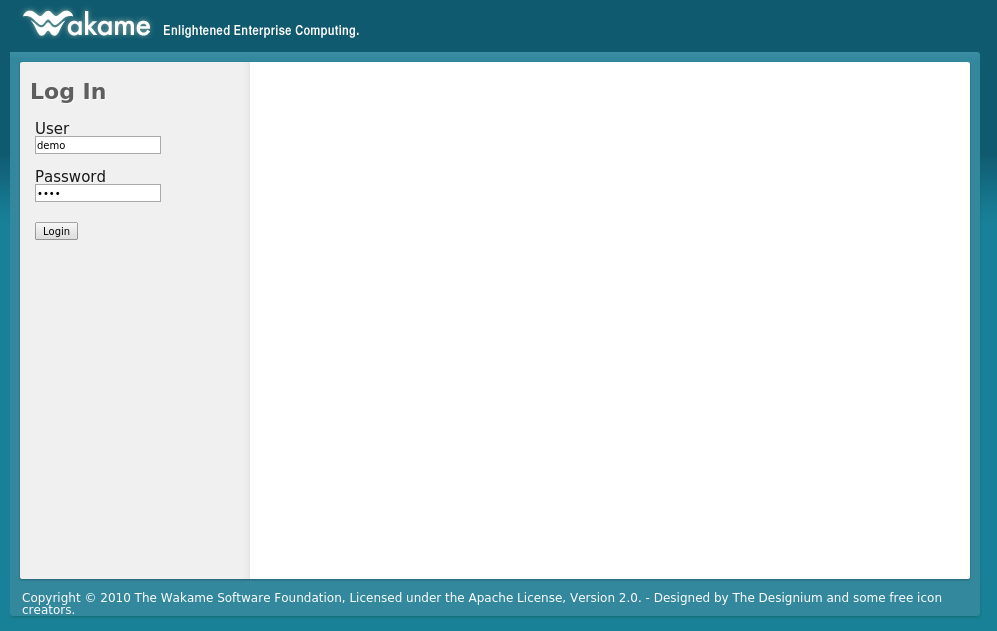

Before we can start an instance there are two things we need. An [RSA](http://en.wikipedia.org/wiki/RSA_(cryptosystem)) **key pair** and a **security group**. The key pair will be used to log into the instance through [SSH](http://en.wikipedia.org/wiki/Secure_Shell). The security group will act as a firewall.

Let's take care of the key pair first. Click on `Key Pairs` in the menu on the left.

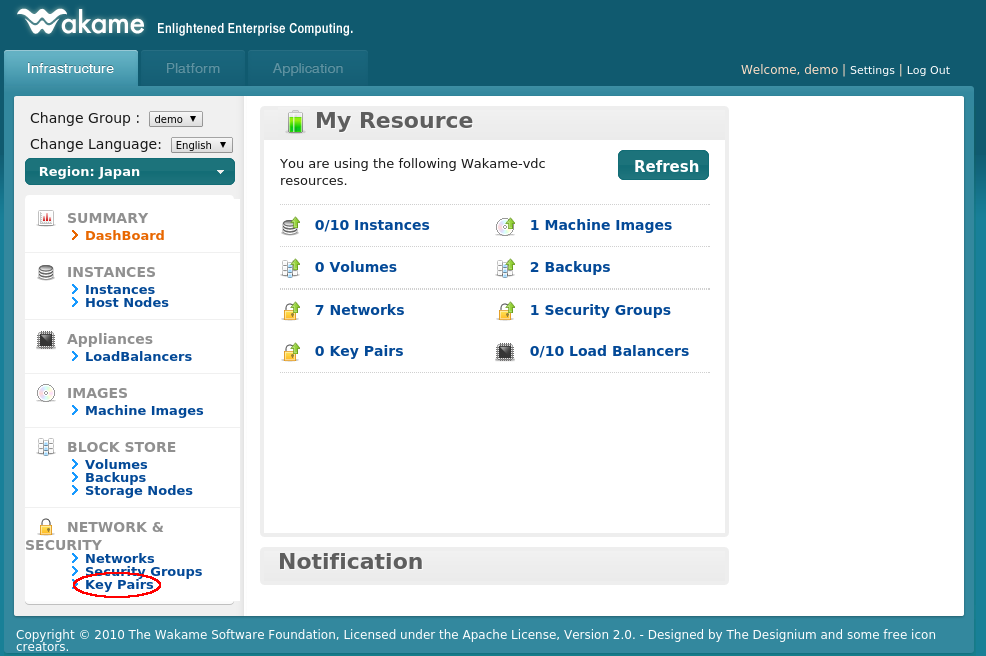

Click on `Create Key Pair`.

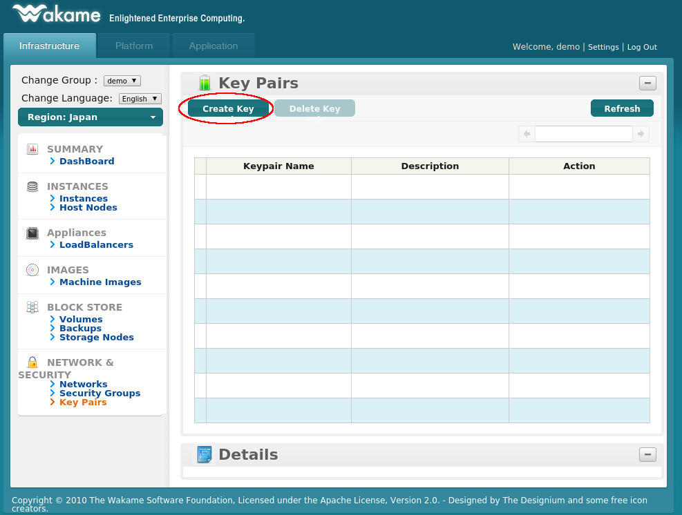

If you already have your own RSA key, you can just register your public key. If you leave the public key field blank, Wakame-vdc will generate a new key for you. Let's do that now.

After you've clicked on `Create`, Wakame-vdc will generate a new RSA key pair and offer the private key for download. On a production environment, this key would be very sensitive information. Make sure to use [https](http://en.wikipedia.org/wiki/HTTP_Secure) when running this on a production server.

We're going to need this private key later so remember where you saved it. The private key will *not* be stored by Wakame-vdc in any way. If you accidentally delete it, it's gone forever.

Fill in a name for your key and click on `Create`.

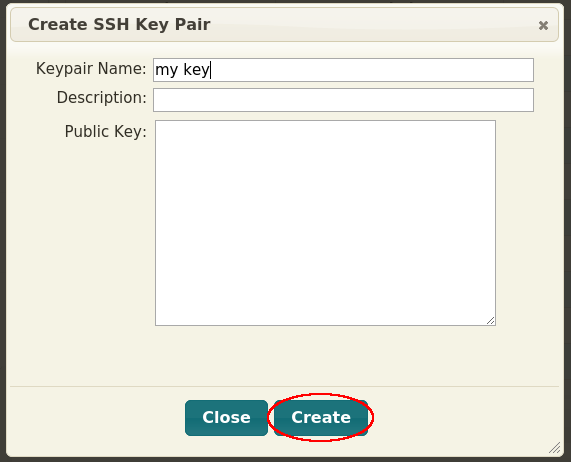

If everything went correctly, we should now be able to see our key pair in the list.

Next we will create a security group. Click on `Security Groups` in the menu on the left.

Click on `Create Security Group` on the top of the page.

By default *all* incoming traffic to instances is blocked by Wakame-vdc. We need to open port 22 so we will be able to log into our instance through ssh later. Fill in a name for your security group and add a rule to open up tcp port 22. Once that's done, click on `Create`.

As was the case for key pairs, we should now be able to see our security group in the list.

Now it's time to actually start an instance. Click on `Machine Images` in the menu on the left.

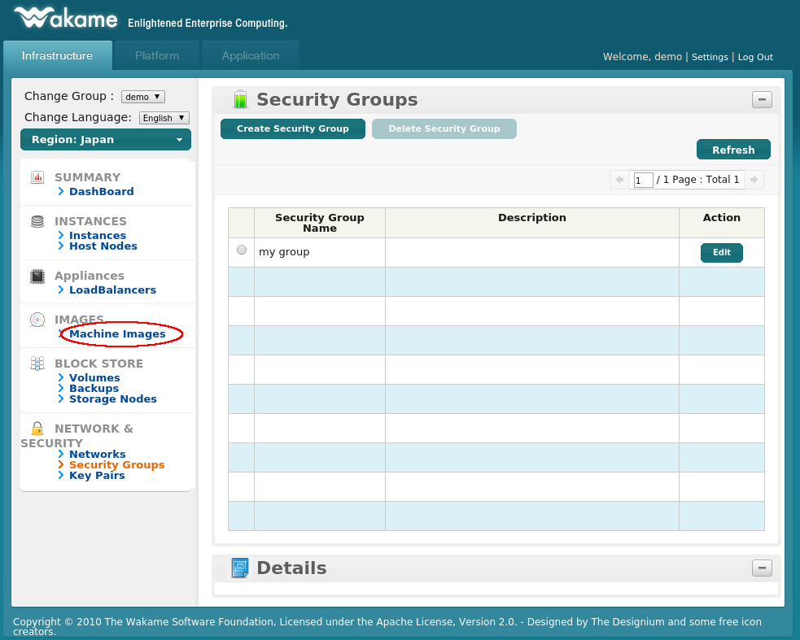

This guide is written based on an image that was set up using the [installation guide](../installation.md). Therefore we have one machine image *wmi-lucid5d*. Your environment might have different machine images registered but the operations will be the same. Select any image from the list and click on `Launch Instance`.

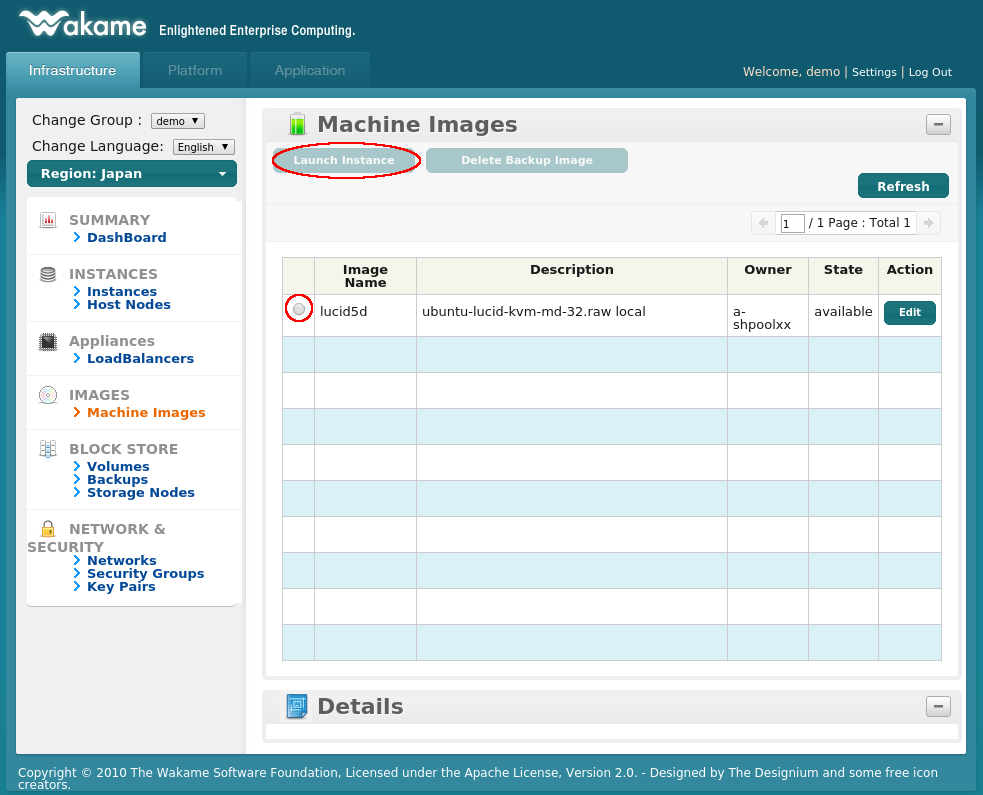

There's a lot of information on the `Launch Instance` dialog. We are only going to fill in the bare essentials needed to launch an instance.

* **Instance Name** (a human readable name for the instance)

* **SSH Key Pair** (the RSA key pair we created before and are going to use to log into the instance)

* **Security Groups** (the security group we created before which will open tcp port 22)

* **eth0** (this will give the instance a virtual network interface and connect it to a network)

Once all of these are filled in, click on `Launch`.

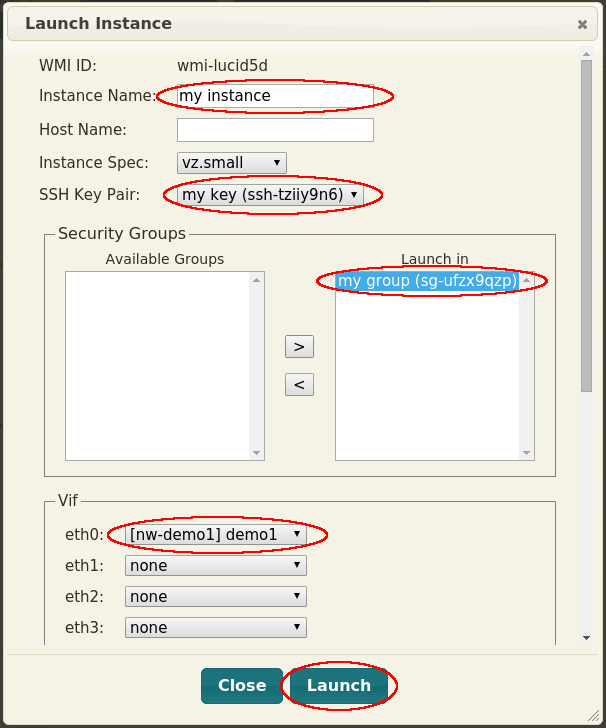

You'll be taken back to the `Machine Images` page. Don't worry if you don't see your instance here. Instances are shown on their own page. Click on `Instances` in the menu on the left.

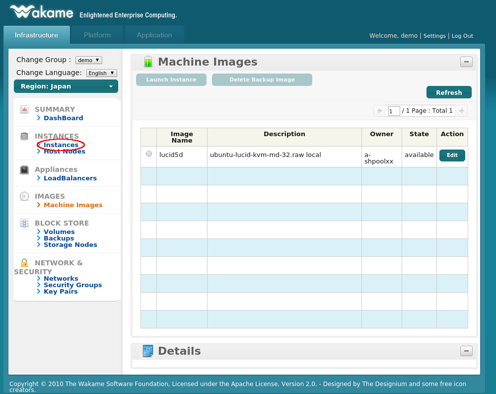

You should be able to see your instance on this page. Under `State` it will say either *running* or *initializing*. If it's the latter then just wait for a while and refresh the page. It should get to the *running* state eventually. If it says *terminated*, then something went wrong. Make sure you've followed the steps in this guide correctly and check out the logs in the `/var/log/wakame-vdc` directory for clues.

Once your instance has reached state *running*, it might still take a little while before you can ssh into it. The *running* state means that Wakame-vdc has started your instance. It's equivalent to pressing the power button on a physical server. The instance is turned on but the OS still needs a little time to boot.

You will also see the ip address that has been assigned to your instance. On the screenshot below that would be `192.168.3.2`.

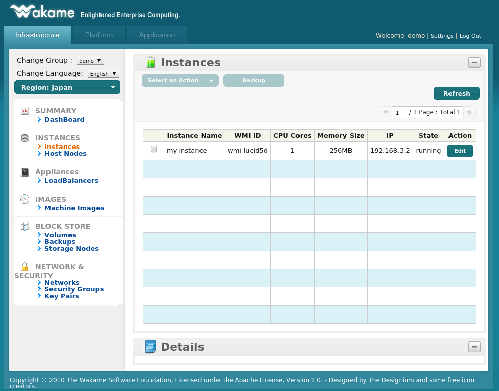

### Using instances

At this point we're done with the Wakame-vdc GUI. That instance is now a server running in a network. We're going to log into it just like you'd log into any other server: using SSH. Remember how we downloaded the RSA private key that we created earlier? This is where we'll use it. On a Linux machine you'd run this command.

    ssh -i /path/to/your/private/key -l username ip-of-your-instance

If we fill in the values used in this guide, we get the following command:

    ssh -i ~/Downloads/ssh-tziiy9n6.pem -l ubuntu 192.168.3.2

That's it. You have now started an instance and can start using it. Feel free to play around and start any number of instances.

### Terminating instances

Once you've decided you don't need an instance any more, you can terminate it. Before you do so, you need to be absolutely sure that you don't need this instance any more. Once an instance is terminated, it is irrevocably deleted. It will not be possible to recover it!

To terminate an instance, select it from the list and click on `Select an Action`.

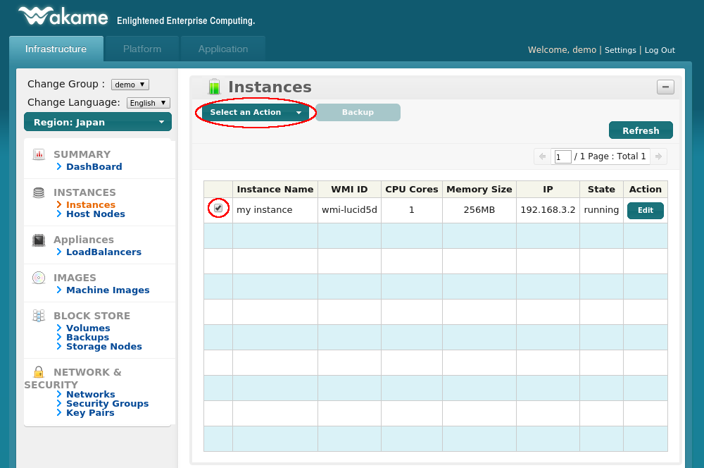

Now click on `Terminate`.

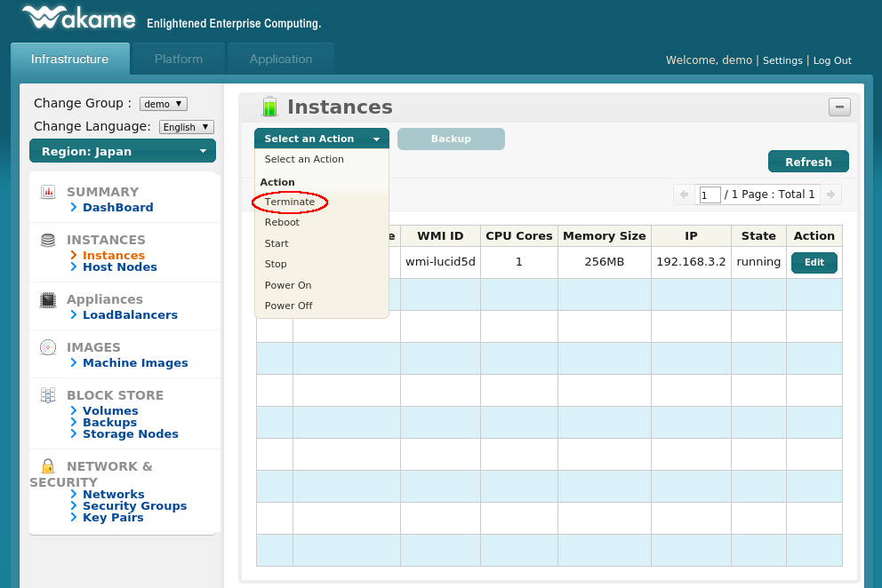

A dialog pops up asking for confirmation. Confirm that this is indeed the instance that you want to terminate and click on `Terminate`.

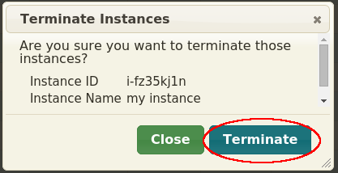

You'll be taken back to the instances list. You'll see the state of your instance is now *shutting down*. If you wait a few seconds and refresh it will have changed to *terminated*. The instance is now gone forever.

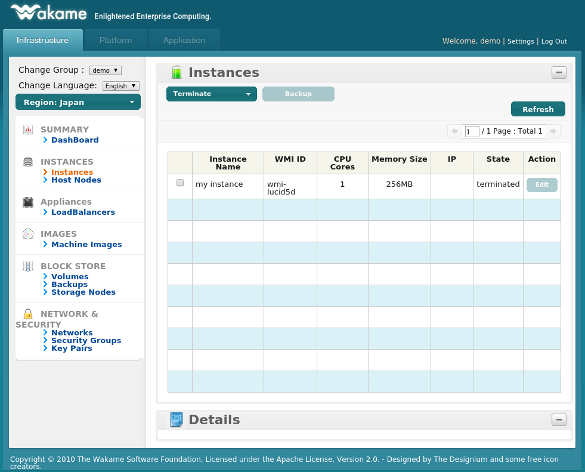

That concludes this basic Wakame-vdc usage guide. We hope everything went smoothly and if you run into any problems, don't hesitate to contact us on the [Wakame Users Group](https://groups.google.com/forum/?hl=en-GB#!forum/wakame-ug). We'll do our best to help you resolve any issues you might run into.

